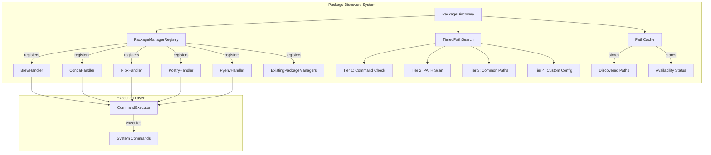
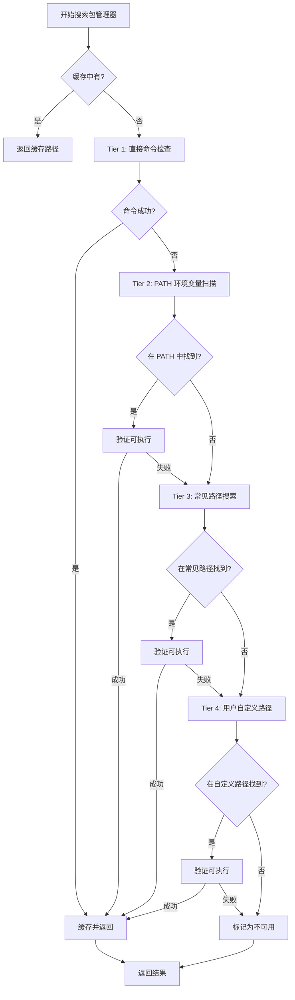

# Design Document: Enhanced Package Discovery

## Overview

本设计扩展 Dev Janitor 的包管理器发现能力，增加对 Homebrew、Conda、Pipx、Poetry 和 Pyenv 的支持，并实现智能路径搜索功能以发现非标准安装的包管理器。

核心设计原则：
1. **分层搜索策略** - 快速路径优先，逐层深入
2. **并行执行** - 多个包管理器同时检测
3. **会话缓存** - 避免重复搜索
4. **优雅降级** - 单个失败不影响整体

## Architecture



### 分层搜索算法



## Components and Interfaces

### 1. PackageManagerHandler 接口

```typescript
/**
 * 包管理器处理器接口
 * 每个包管理器实现此接口
 */
interface PackageManagerHandler {
  /** 包管理器标识符 */
  readonly id: PackageManagerType
  
  /** 显示名称 */
  readonly displayName: string
  
  /** 可执行文件名 */
  readonly executable: string
  
  /** 常见安装路径 */
  readonly commonPaths: string[]
  
  /** 检查是否可用 */
  checkAvailability(): Promise<boolean>
  
  /** 列出已安装的包 */
  listPackages(): Promise<PackageInfo[]>
  
  /** 卸载包 */
  uninstallPackage(packageName: string): Promise<boolean>
  
  /** 解析输出 */
  parseOutput(output: string): PackageInfo[]
}
```

### 2. TieredPathSearch 类

```typescript
/**
 * 分层路径搜索器
 * 实现四层搜索策略
 */
class TieredPathSearch {
  private cache: PathCache
  
  /**
   * 搜索包管理器可执行文件
   * @param executable 可执行文件名
   * @param commonPaths 常见路径列表
   * @returns 搜索结果，包含路径和发现方法
   */
  async findExecutable(
    executable: string,
    commonPaths: string[]
  ): Promise<SearchResult | null>
  
  /**
   * Tier 1: 直接命令检查
   */
  private async checkDirectCommand(executable: string): Promise<SearchResult | null>
  
  /**
   * Tier 2: PATH 环境变量扫描
   */
  private async scanPathEnvironment(executable: string): Promise<SearchResult | null>
  
  /**
   * Tier 3: 常见路径搜索
   */
  private async searchCommonPaths(
    executable: string,
    paths: string[]
  ): Promise<SearchResult | null>
  
  /**
   * Tier 4: 用户自定义路径
   */
  private async searchCustomPaths(executable: string): Promise<SearchResult | null>
}

/**
 * 搜索结果
 */
interface SearchResult {
  path: string
  method: DiscoveryMethod
  inPath: boolean  // 是否在 PATH 中
}
```

### 3. PathCache 类

```typescript
/**
 * 路径缓存
 * 会话级别缓存，避免重复搜索
 */
class PathCache {
  private paths: Map<string, string | null>
  private availability: Map<string, boolean>
  private ttl: number // 缓存有效期
  
  /** 获取缓存的路径 */
  getPath(manager: string): string | null | undefined
  
  /** 设置路径缓存 */
  setPath(manager: string, path: string | null): void
  
  /** 获取可用性状态 */
  getAvailability(manager: string): boolean | undefined
  
  /** 设置可用性状态 */
  setAvailability(manager: string, available: boolean): void
  
  /** 清除缓存 */
  clear(): void
}
```

### 4. 各包管理器处理器

#### BrewHandler

```typescript
class BrewHandler implements PackageManagerHandler {
  readonly id = 'brew'
  readonly displayName = 'Homebrew'
  readonly executable = 'brew'
  readonly commonPaths = [
    '/opt/homebrew/bin/brew',      // Apple Silicon Mac
    '/usr/local/bin/brew',          // Intel Mac
    '~/.homebrew/bin/brew'          // 自定义安装
  ]
  
  async listPackages(): Promise<PackageInfo[]> {
    // 同时获取 formula 和 cask
    const [formulas, casks] = await Promise.all([
      this.listFormulas(),
      this.listCasks()
    ])
    return [...formulas, ...casks]
  }
  
  private async listFormulas(): Promise<PackageInfo[]>
  private async listCasks(): Promise<PackageInfo[]>
}
```

#### CondaHandler

```typescript
class CondaHandler implements PackageManagerHandler {
  readonly id = 'conda'
  readonly displayName = 'Conda'
  readonly executable = 'conda'
  readonly commonPaths = [
    '~/anaconda3/bin/conda',
    '~/miniconda3/bin/conda',
    '/opt/anaconda3/bin/conda',
    '/opt/miniconda3/bin/conda',
    '~/.conda/bin/conda',
    // Windows paths
    '%USERPROFILE%\\anaconda3\\Scripts\\conda.exe',
    '%USERPROFILE%\\miniconda3\\Scripts\\conda.exe'
  ]
}
```

#### PipxHandler

```typescript
class PipxHandler implements PackageManagerHandler {
  readonly id = 'pipx'
  readonly displayName = 'Pipx'
  readonly executable = 'pipx'
  readonly commonPaths = [
    '~/.local/bin/pipx',
    '/usr/local/bin/pipx',
    // Windows
    '%USERPROFILE%\\.local\\bin\\pipx.exe'
  ]
}
```

#### PoetryHandler

```typescript
class PoetryHandler implements PackageManagerHandler {
  readonly id = 'poetry'
  readonly displayName = 'Poetry'
  readonly executable = 'poetry'
  readonly commonPaths = [
    '~/.local/bin/poetry',
    '~/.poetry/bin/poetry',
    // Windows
    '%APPDATA%\\Python\\Scripts\\poetry.exe'
  ]
}
```

#### PyenvHandler

```typescript
class PyenvHandler implements PackageManagerHandler {
  readonly id = 'pyenv'
  readonly displayName = 'Pyenv'
  readonly executable = 'pyenv'
  readonly commonPaths = [
    '~/.pyenv/bin/pyenv',
    '/opt/pyenv/bin/pyenv',
    '/usr/local/bin/pyenv'
  ]
}
```

### 5. PackageDiscovery 主类

```typescript
/**
 * 包发现主类
 * 协调所有包管理器的发现和列表操作
 */
class PackageDiscovery {
  private handlers: Map<PackageManagerType, PackageManagerHandler>
  private pathSearch: TieredPathSearch
  private cache: PathCache
  
  /**
   * 发现所有可用的包管理器
   * 并行执行，提高性能
   * @returns 包管理器状态信息数组
   */
  async discoverAvailableManagers(): Promise<PackageManagerStatus[]>
  
  /**
   * 列出所有包
   * 从所有可用的包管理器获取包列表
   */
  async listAllPackages(
    onProgress?: (manager: string, status: string) => void
  ): Promise<PackageInfo[]>
  
  /**
   * 列出指定包管理器的包
   */
  async listPackages(manager: PackageManagerType): Promise<PackageInfo[]>
  
  /**
   * 卸载包
   */
  async uninstallPackage(
    packageName: string,
    manager: PackageManagerType
  ): Promise<boolean>
  
  /**
   * 获取包管理器状态
   * 包含 PATH 配置信息
   */
  async getManagerStatus(manager: PackageManagerType): Promise<PackageManagerStatus>
}
```

## Data Models

### 扩展的 PackageManagerType

```typescript
type PackageManagerType = 
  | 'npm' 
  | 'pip' 
  | 'composer' 
  | 'cargo' 
  | 'gem'
  // 新增
  | 'brew'
  | 'conda'
  | 'pipx'
  | 'poetry'
  | 'pyenv'
```

### 扩展的 PackageInfo

```typescript
interface PackageInfo {
  name: string
  version: string
  location: string  // 扩展支持: 'formula', 'cask', 'conda-env', 'pipx-venv', 'pyenv-version'
  manager: PackageManagerType
  description?: string
  homepage?: string
  // 新增字段
  channel?: string      // Conda channel
  environment?: string  // Conda/Poetry environment name
}
```

### 包管理器状态信息

```typescript
/**
 * 包管理器可用性状态
 */
type ManagerAvailabilityStatus = 
  | 'available'      // 在 PATH 中可直接使用
  | 'path_missing'   // 已安装但不在 PATH 中
  | 'not_installed'  // 未安装

/**
 * 发现方法
 */
type DiscoveryMethod = 
  | 'direct_command'  // Tier 1: 直接命令成功
  | 'path_scan'       // Tier 2: PATH 扫描找到
  | 'common_path'     // Tier 3: 常见路径找到
  | 'custom_path'     // Tier 4: 自定义路径找到

/**
 * 包管理器状态信息
 */
interface PackageManagerStatus {
  manager: PackageManagerType
  status: ManagerAvailabilityStatus
  discoveryMethod?: DiscoveryMethod
  foundPath?: string
  inPath: boolean  // 是否在 PATH 环境变量中
  message?: string // 状态消息（如 PATH 配置建议）
}
```

### 用户配置文件格式

```typescript
// ~/.config/dev-janitor/package-managers.json
interface PackageManagerConfig {
  customPaths?: {
    brew?: string[]
    conda?: string[]
    pipx?: string[]
    poetry?: string[]
    pyenv?: string[]
  }
  disabled?: PackageManagerType[]  // 禁用的包管理器
  timeout?: number                  // 自定义超时时间
}
```


## Correctness Properties

*A property is a characteristic or behavior that should hold true across all valid executions of a system—essentially, a formal statement about what the system should do. Properties serve as the bridge between human-readable specifications and machine-verifiable correctness guarantees.*

### Property 1: Parser Output Correctness

*For any* valid output string from any supported package manager (brew, conda, pipx, poetry, pyenv), parsing SHALL produce an array of PackageInfo objects where each object has:
- A non-empty `name` field
- A non-empty `version` field  
- The `manager` field set to the correct package manager identifier
- The `location` field set appropriately for the package type

**Validates: Requirements 1.4, 1.5, 2.3, 2.4, 3.3, 3.4, 4.3, 5.3, 5.4**

### Property 2: Correct List Command Execution

*For any* package manager type, when listing packages, the module SHALL execute the correct command:
- brew: `brew list --versions` for formulas, `brew list --cask --versions` for casks
- conda: `conda list --json`
- pipx: `pipx list --json`
- pyenv: `pyenv versions --bare`

**Validates: Requirements 1.1, 1.2, 2.1, 3.1, 5.1**

### Property 3: Correct Uninstall Command Execution

*For any* package name and package manager type, uninstalling SHALL execute the correct command:
- brew formula: `brew uninstall <package>`
- brew cask: `brew uninstall --cask <package>`
- conda: `conda remove -y <package>`
- pipx: `pipx uninstall <package>`
- pyenv: `pyenv uninstall -f <version>`

**Validates: Requirements 7.1, 7.2, 7.3, 7.4, 7.5**

### Property 4: Availability State Consistency

*For any* package manager, the availability status SHALL be consistent with command execution results:
- If version command succeeds → manager is marked available
- If version command fails → manager is marked unavailable

**Validates: Requirements 6.1, 6.2, 6.3**

### Property 5: Path Caching Correctness

*For any* package manager, once a path is discovered:
- Subsequent lookups SHALL return the cached path without re-executing search
- The cache SHALL persist for the duration of the application session

**Validates: Requirements 12.3, 13.2**

### Property 6: Parsing Resilience

*For any* input string (including malformed, empty, or invalid JSON):
- Parsing SHALL NOT throw an exception
- Parsing SHALL return an array (possibly empty)
- Valid entries in malformed input SHALL still be extracted

**Validates: Requirements 9.1, 9.2, 9.3**

### Property 7: Tiered Search Order

*For any* package manager search, the tiers SHALL be executed in order:
1. Direct command check (fastest)
2. PATH environment scan
3. Common paths search
4. Custom config paths

And search SHALL terminate early when a valid executable is found.

**Validates: Requirements 10.1, 10.6, 13.3, 13.4**

### Property 8: Custom Path Priority

*For any* package manager with custom paths configured, custom paths SHALL be searched before default common paths.

**Validates: Requirements 11.2**

### Property 9: Parallel Execution Independence

*For any* set of package managers being checked in parallel, the failure of one manager's check SHALL NOT affect the results of other managers.

**Validates: Requirements 13.1**

### Property 10: Unavailable Manager Graceful Handling

*For any* package manager that is not installed, scanning SHALL:
- Return an empty array
- NOT throw an error
- NOT block other package managers

**Validates: Requirements 1.3, 2.2, 3.2, 4.2, 5.2**

### Property 11: PATH Configuration Status Detection

*For any* package manager that is found:
- If found via Tier 1 (direct command) or Tier 2 (PATH scan) → status SHALL be 'available' and inPath SHALL be true
- If found via Tier 3 (common paths) or Tier 4 (custom paths) → status SHALL be 'path_missing' and inPath SHALL be false
- If not found in any tier → status SHALL be 'not_installed'
- The discoveryMethod field SHALL accurately reflect which tier found the executable

**Validates: Requirements 14.1, 14.2, 14.3, 14.4**

## Error Handling

### 错误类型

| 错误场景 | 处理策略 | 用户反馈 |
|---------|---------|---------|
| 包管理器不存在 | 静默跳过，返回空数组 | 无（正常情况） |
| 命令执行超时 | 标记为不可用，继续其他 | 可选警告 |
| 输出解析失败 | 尝试文本回退解析 | 日志记录 |
| 权限不足 | 返回错误信息 | 显示权限提示 |
| 配置文件损坏 | 使用默认配置 | 警告提示 |

### 错误恢复流程

```typescript
async function safeListPackages(handler: PackageManagerHandler): Promise<PackageInfo[]> {
  try {
    // 检查可用性
    const available = await handler.checkAvailability()
    if (!available) {
      return []
    }
    
    // 尝试列出包
    return await handler.listPackages()
  } catch (error) {
    // 记录错误但不中断
    console.error(`Error listing ${handler.id} packages:`, error)
    return []
  }
}
```

## Testing Strategy

### 测试方法

本功能采用双重测试策略：
1. **单元测试** - 验证特定示例和边界情况
2. **属性测试** - 验证所有输入的通用属性

### 属性测试配置

- 使用 `fast-check` 库进行属性测试
- 每个属性测试最少运行 100 次迭代
- 每个测试标注对应的设计属性

### 测试用例分类

#### 解析器测试

| 测试类型 | 描述 | 对应属性 |
|---------|------|---------|
| Property | Brew 输出解析正确性 | Property 1 |
| Property | Conda JSON 解析正确性 | Property 1 |
| Property | Pipx JSON 解析正确性 | Property 1 |
| Property | Pyenv 输出解析正确性 | Property 1 |
| Property | 解析容错性 | Property 6 |
| Unit | 空输出处理 | Property 6 |
| Unit | 畸形 JSON 回退 | Property 6 |

#### 命令执行测试

| 测试类型 | 描述 | 对应属性 |
|---------|------|---------|
| Property | 列表命令正确性 | Property 2 |
| Property | 卸载命令正确性 | Property 3 |
| Unit | 超时处理 | Error Handling |

#### 搜索策略测试

| 测试类型 | 描述 | 对应属性 |
|---------|------|---------|
| Property | 分层搜索顺序 | Property 7 |
| Property | 缓存一致性 | Property 5 |
| Property | 自定义路径优先级 | Property 8 |
| Unit | PATH 扫描 | Property 7 |
| Unit | 常见路径搜索 | Property 7 |

#### 集成测试

| 测试类型 | 描述 | 对应属性 |
|---------|------|---------|
| Property | 并行执行独立性 | Property 9 |
| Property | 不可用管理器处理 | Property 10 |
| Unit | 完整发现流程 | All |

### 生成器设计

```typescript
// Brew 输出生成器
const brewOutputArb = fc.array(
  fc.record({
    name: fc.string({ minLength: 1 }).filter(s => !s.includes(' ')),
    version: fc.string({ minLength: 1 }).filter(s => /^\d/.test(s))
  })
).map(packages => 
  packages.map(p => `${p.name} ${p.version}`).join('\n')
)

// Conda JSON 生成器
const condaJsonArb = fc.array(
  fc.record({
    name: fc.string({ minLength: 1 }),
    version: fc.string({ minLength: 1 }),
    channel: fc.string({ minLength: 1 })
  })
).map(packages => JSON.stringify(packages))

// Pipx JSON 生成器
const pipxJsonArb = fc.record({
  venvs: fc.dictionary(
    fc.string({ minLength: 1 }),
    fc.record({
      metadata: fc.record({
        main_package: fc.record({
          package: fc.string({ minLength: 1 }),
          package_version: fc.string({ minLength: 1 })
        })
      })
    })
  )
}).map(data => JSON.stringify(data))
```

### 测试标注格式

每个属性测试必须包含以下注释：

```typescript
/**
 * Feature: enhanced-package-discovery
 * Property 1: Parser Output Correctness
 * Validates: Requirements 1.4, 1.5, 2.3, 2.4, 3.3, 3.4, 4.3, 5.3, 5.4
 */
test.prop([brewOutputArb])('brew parser produces valid PackageInfo', (output) => {
  const result = parseBrewOutput(output)
  return result.every(pkg => 
    pkg.name.length > 0 &&
    pkg.version.length > 0 &&
    pkg.manager === 'brew'
  )
})
```
